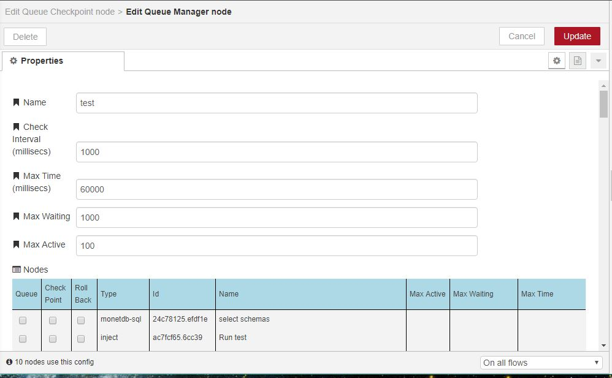
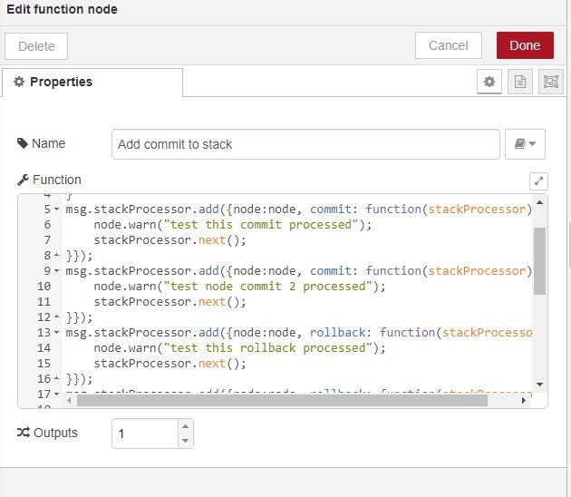
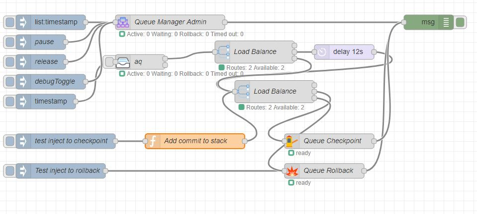

# [node-red-contrib-queuemanager][2]

[Node-Red][1] nodes for queue managed of nodes .

## Queue Manager (Configuration)

Management node which can turn other nodes to act like queue, checkpoint or rollback by wrappering base node input with queue manager input which is called before passing message to input of node. For example catch node can be made to act like rollback node.

 

------------------------------------------------------------

## Queue Manager Admin

Management node which can turn other nodes to act like queue, checkpoint or rollback by wrappering base node input with queue manager input which is called before passing mEssage to input of node. For example catch node can be made to act like rollback node.
 
 
 
 Node input processes messages where the topic drives process

##### Topic List

out message payload contains of metrics for all queues

##### Topic pause

Queue all incoming messages. Out message payload contains OK

release

Activate queue processing if paused. Out message payload contains OK

##### Topic set

Change controlling parameters for queue manager. Payload contains JSON object with properties that can be set. 
Out message payload contains OK
 
------------------------------------------------------------
 
## Queue

 

A queuing node which sets how many active messages can be active, maximum queue depth and a time out for the message.  

 

------------------------------------------------------------

## Checkpoint 

 

A point that applies any commits in commit stack of message and activates next waiting message. Any node can add to commit stack by:

	msg.processStack.add({node:node
		,commit:function(processStack) {
			// add logic to commit process
			processStack.next();
		}
	});

The functions are called with scope of node property in FILO order.

------------------------------------------------------------
 
## Rollback

 

A point that applies any rollbacks in rollback stack of message and activates next waiting message. Any node can add to rollback stack by: 

	msg.processStack.push({node:node,
		rollback:function(processStack) {
			// add logic to rollback process
			processStack.next();
		} 
	})
	
The functions are called with scope of node property in FILO order.

------------------------------------------------------------

## Adding Commit/Rollback to Function

------------------------------------------------------------
 
# Install

Run the following command in the root directory of your Node-RED install

    npm install node-red-contrib-queuemanager
    
------------------------------------------------------------

# Test

Test/example flow in test/testflow.json which requires [loadbalance][4] 

------------------------------------------------------------

# Version

0.1.2 Fix queue consumption to FIFO
0.1.0 Major rewrite to have stack processor be callback thus allow async rollback/commit calls

0.0.4 Add ability to hold/release queue and release a single message

0.0.3 Add queue status to queue node and empty queue function

0.0.2 Fix time issue with queue manager being recognised and control on overflow message flooding

0.0.1 Base

------------------------------------------------------------

# Author

[Peter Prib][3]

[1]: http://nodered.org
[2]: https://www.npmjs.com/package/node-red-contrib-queuemanager
[3]: https://github.com/peterprib
[4]: https://www.npmjs.com/package/node-red-contrib-loadbalance
